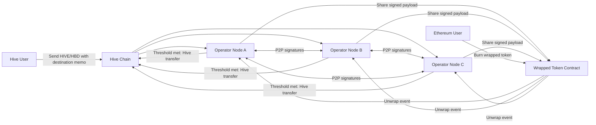

# Hive Bridge Public Explainer

## What This Bridge Does

This bridge lets people move value between Hive and Ethereum:

- `HIVE/HBD -> Ethereum`: users receive wrapped tokens.
- `Ethereum -> HIVE/HBD`: users burn wrapped tokens and receive native tokens back on Hive.

No single operator can move funds alone. Multiple independent operators must approve each action.

## Why It Is Trust-Reduced

- `Multi-operator approvals`: every wrap/unwrap requires a threshold of signatures.
- `On-chain verification`: signatures are verified before minting or releasing funds.
- `Public operator set`: operator list and threshold come from Hive treasury authority.
- `Event-driven checks`: both chains are monitored continuously for expected events.

## Simple System View

## User Journey (Non-Technical)

### A) Move from Hive to Ethereum

1. User sends HIVE/HBD to the bridge treasury with a destination Ethereum address.
2. Operators detect the transfer and independently sign the same request.
3. When enough signatures are collected, the signed payload can be submitted to the Ethereum contract.
4. The contract verifies signatures on-chain and then mints wrapped tokens.

### B) Move from Ethereum to Hive

1. User burns wrapped tokens in the Ethereum bridge contract.
2. Operators detect the burn event and prepare a Hive transfer.
3. When enough signatures are collected, a signed Hive transaction is broadcast to release funds.

## Governance (How Rules Change)

- Operators can propose signer/threshold changes through governance memos.
- Votes are signed by operators and shared over P2P.
- Hive-side governance transactions are broadcast by the node once threshold is met.
- For Ethereum-side governance, signatures are collected and then submitted on-chain by a transaction sender.

## Public API Surface (for transparency dashboards)

- `GET /` overall health, operators, threshold, and pending counts
- `GET /pending-hive-wraps` pending wrap queue
- `GET /pending-hive-unwraps` pending unwrap queue
- `GET /peers` connected peer nodes
- `GET /proposals` active governance proposals
